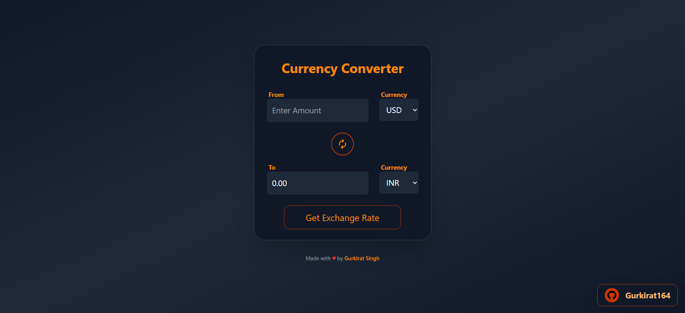

# Currency Converter

A simple and modern React app to convert currencies using live exchange rates from ExchangeRate-API.

## Features
- Convert between 150+ currencies
- Live exchange rates
- Swap currencies instantly
- Responsive and clean UI
- Select currencies from dropdowns
- Input validation and formatted results

## Preview
[Live Demo](https://currency-converter-opal-nu.vercel.app/)


## Getting Started

### Prerequisites
- Node.js (v16 or above recommended)
- npm or yarn

### Installation
1. **Clone the repository:**
   ```bash
   git clone https://github.com/Gurkirat164/CurrencyConverter.git
   cd CurrencyConverter
   ```
2. **Install dependencies:**
   ```bash
   npm install
   # or
   yarn install
   ```
3. **Set up your API key:**
   - Get a free API key from [ExchangeRate-API](https://www.exchangerate-api.com/)
   - Create a `.env` file in the root directory:
     ```env
     VITE_API_KEY=your_api_key_here
     ```

### Running the App
```bash
npm run dev
# or
yarn dev
```
Open [http://localhost:5173](http://localhost:5173) in your browser.

## Usage
- Enter the amount you want to convert
- Select the source and target currencies
- Click "Get Exchange Rate" to see the result
- Use the swap button to switch currencies

## Technologies Used
- React
- Vite
- Tailwind CSS
- ExchangeRate-API

## Folder Structure
```
CurrencyConverter/
├── public/
├── src/
│   ├── components/
│   ├── hooks/
│   ├── App.jsx
│   ├── main.jsx
│   └── index.css
├── .env
├── package.json
├── README.md
└── ...
```

## License
This project is licensed under the MIT License.

## Author
[Gurkirat Singh](https://github.com/Gurkirat164)